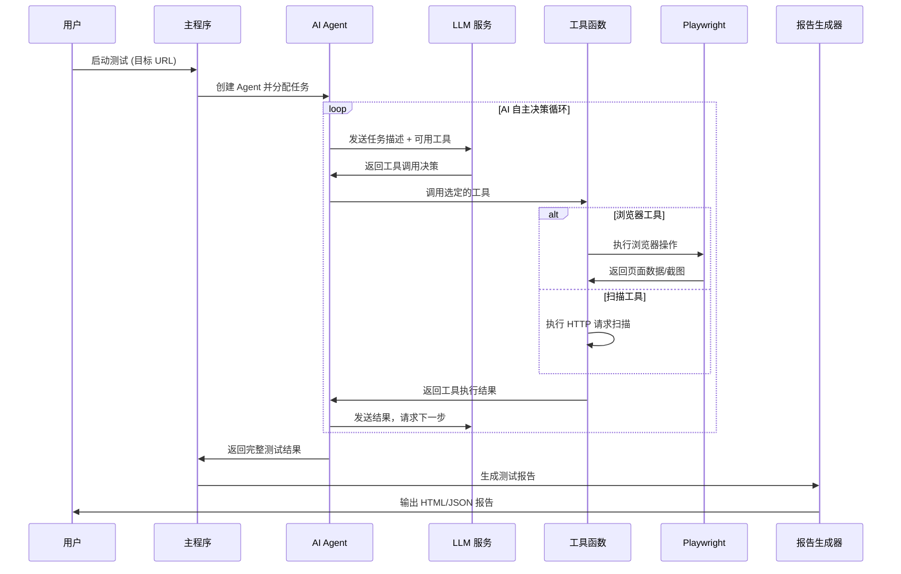

# LSJ WebSec Automation
<div align="center">

**基于 Autogen + Playwright 的智能化自动化渗透测试工具**

[](https://github.com/RusianHu/lsj-websec-automation/stargazers)
[](https://github.com/RusianHu/lsj-websec-automation/network/members)
[](LICENSE)
[](https://www.python.org/)
[](https://github.com/microsoft/autogen)
[](https://playwright.dev/)

</div>

---

## 📖 项目简介

LSJ WebSec Automation 自动化渗透测试工具，结合了 **Microsoft Autogen** 的 AI Agent 编排能力和 **Playwright** 的浏览器自动化技术，进行自动化渗透测试。

## 🏗️ 逻辑架构

### 工作流程图



---

<details>
<summary>执行示例 </summary>

```bash
PS C:\Users\admin\Desktop\porg\lsj-websec-automation> .\venv\Scripts\python.exe .\main.py
2025-10-27 00:24:27 | INFO     | utils.patch_autogen:apply_patch:152 - 正在应用 Autogen 兼容性补丁...
2025-10-27 00:24:27 | INFO     | utils.patch_autogen:apply_patch:164 - ✅ Autogen 兼容性补丁已应用
2025-10-27 00:24:27 | INFO     | __main__:<module>:18 - Autogen 兼容性补丁已启用(用于修复某些 OpenAI 兼容服务器的 additionalProperties 字段问题)
╭─────────────────────────────────────────────────────────────────────────────────────────────────────────────────────────────────────────────────────────────────────────────────────────────────────────────╮
│                                                                                                                                                                                                             │
│ ╔═══════════════════════════════════════════════════════════╗                                                                                                                                               │
│ ║                                                           ║                                                                                                                                               │
│ ║        LSJ WebSec Automation                              ║                                                                                                                                               │
│ ║        基于 Autogen + Playwright 的自动化渗透测试工具      ║                                                                                                                                              │
│ ║                                                           ║                                                                                                                                               │
│ ╚═══════════════════════════════════════════════════════════╝                                                                                                                                               │
│                                                                                                                                                                                                             │
╰─────────────────────────────────────────────────────────────────────────────────────────────────────────────────────────────────────────────────────────────────────────────────────────────────────────────╯

欢迎使用 LSJ WebSec Automation!


请选择操作:
1. Web 扫描
2. 漏洞测试
3. 浏览器自动化测试
4. 完整测试（包含以上所有）
5. 退出

请输入选项 [1/2/3/4/5] (1): 3

请输入目标 URL (http://testphp.vulnweb.com): yanshanlaosiji.top
2025-10-27 00:24:36 | INFO     | __main__:run_browser_automation:299 - 开始浏览器自动化测试: https://yanshanlaosiji.top
2025-10-27 00:24:36 | INFO     | agents.base_agent:__init__:63 - Agent 'BrowserAutomation' 初始化成功
2025-10-27 00:24:36 | INFO     | agents.base_agent:run:80 - Agent 'BrowserAutomation' 开始执行任务:
    请使用浏览器自动化工具对 https://yanshanlaosiji.top 进行完整的安全测试，必须完成以下所有步骤：

    第一步：访问和初步分析
    1.1 使用 navigate_to_url 工具访问目标网站
    1.2 使用 take_screenshot 工具截取首页截图
    1.3 使用 analyze_page_structure 工具分析页面整体结构
    1.4 使用 analyze_security_headers 工具检查 HTTP 安全响应头

    第二步：深入分析页面元素
    2.1 使用 find_forms 工具查找所有表单
    2.2 使用 find_links 工具查找所有链接
    2.3 使用 get_page_content 工具获取完整的 HTML 内容（仅获取前 2000 字符）

    第三步：表单安全测试（如果存在表单）
    3.1 使用 clear_event_caches 清空事件缓存
    3.2 使用 test_form_with_payloads 批量测试 XSS payload:
        - <script>alert('XSS')</script>
        - 
        - "><script>alert('XSS')</script>
    3.3 使用 get_dialog_events 检查是否触发了 alert (XSS 证据)
    3.4 使用 get_console_logs 检查控制台错误
    3.5 使用 get_js_errors 检查 JavaScript 运行时错误

    第四步：网络和 JavaScript 安全检测
    4.1 使用 get_network_events 获取网络请求和响应
    4.2 使用 execute_javascript 检查是否存在敏感信息泄露
    4.3 检查 Cookie 安全设置
    4.4 检查是否存在不安全的第三方脚本

    第五步：生成测试报告
    5.1 总结发现的所有安全问题（包括 XSS、安全头缺失、JS 错误等）
    5.2 列出测试过的功能点
    5.3 提供安全建议
    5.4 在报告末尾添加 "TERMINATE" 表示完成

    重要提示：
    - 必须按顺序完成所有步骤，不要跳过任何一步
    - 每一步都要实际调用相应的工具函数
    - 使用新的观测工具收集安全证据（console logs, dialogs, network events）
    - 详细记录每个工具调用的结果
    - 如果某个工具调用失败，记录错误信息并继续下一步
    - 最后必须提供完整的测试总结报告并说 "TERMINATE"
    
2025-10-27 00:24:36 | INFO     | agents.base_agent:run:81 - 最大轮数设置: 20
C:\Users\admin\Desktop\porg\lsj-websec-automation\venv\lib\site-packages\autogen_agentchat\agents\_assistant_agent.py:1109: UserWarning: Finish reason mismatch: stop != tool_calls when tool_calls are present. Finish reason may not be accurate. This may be due to the API used that is not returning the correct finish reason.
  model_result = await model_client.create(
2025-10-27 00:24:48 | INFO     | utils.browser:start:32 - 正在启动浏览器...
2025-10-27 00:24:49 | INFO     | utils.browser:_setup_event_listeners:251 - 事件监听器已设置
2025-10-27 00:24:49 | INFO     | utils.browser:start:73 - 浏览器启动成功
2025-10-27 00:24:49 | INFO     | utils.browser:goto:107 - 导航到: https://yanshanlaosiji.top
2025-10-27 00:24:52 | INFO     | tools.browser_tools:navigate_to_url:48 - 成功导航到: https://yanshanlaosiji.top
2025-10-27 00:24:54 | INFO     | tools.browser_tools:take_screenshot:85 - 截图已保存: C:\Users\admin\Desktop\porg\lsj-websec-automation\output\screenshots\homepage_screenshot.png
2025-10-27 00:24:57 | INFO     | tools.browser_tools:analyze_page_structure:387 - 页面结构分析完成
2025-10-27 00:24:58 | INFO     | tools.browser_tools:analyze_security_headers:635 - 安全头分析完成, 缺失 3 个安全头
2025-10-27 00:24:59 | INFO     | tools.browser_tools:find_forms:295 - 找到 0 个表单
2025-10-27 00:25:01 | INFO     | tools.browser_tools:find_links:335 - 找到 16 个链接
2025-10-27 00:25:08 | INFO     | utils.browser:clear_event_caches:267 - 事件缓存已清空
2025-10-27 00:25:08 | INFO     | tools.browser_tools:clear_event_caches:601 - 事件缓存已清空
2025-10-27 00:25:09 | INFO     | tools.browser_tools:get_dialog_events:524 - 获取到 0 个对话框事件
2025-10-27 00:25:10 | INFO     | tools.browser_tools:get_console_logs:454 - 获取到 0 条控制台日志
2025-10-27 00:25:13 | INFO     | tools.browser_tools:get_js_errors:486 - 获取到 0 个 JavaScript 错误
2025-10-27 00:25:15 | INFO     | tools.browser_tools:get_network_events:570 - 获取到 0 个请求, 0 个响应
2025-10-27 00:25:22 | ERROR    | tools.browser_tools:execute_javascript:221 - 执行 JavaScript 失败: Page.evaluate: SyntaxError: Illegal return statement
    at eval (<anonymous>)
    at UtilityScript.evaluate (<anonymous>:291:30)
    at UtilityScript.<anonymous> (<anonymous>:1:44)
2025-10-27 00:25:27 | INFO     | tools.browser_tools:execute_javascript:213 - 成功执行 JavaScript
2025-10-27 00:25:31 | ERROR    | tools.browser_tools:execute_javascript:221 - 执行 JavaScript 失败: Page.evaluate: SyntaxError: Illegal return statement
    at eval (<anonymous>)
    at UtilityScript.evaluate (<anonymous>:291:30)
    at UtilityScript.<anonymous> (<anonymous>:1:44)
2025-10-27 00:25:31 | INFO     | agents.base_agent:run:98 - Agent 'BrowserAutomation' 任务执行完成

浏览器自动化测试完成

正在生成报告...
2025-10-27 00:25:31 | INFO     | tools.report_generator:generate_html_report:190 - HTML 报告已生成: C:\Users\admin\Desktop\porg\lsj-websec-automation\output\reports\browser_test_20251027_002531.html
2025-10-27 00:25:31 | INFO     | tools.report_generator:generate_json_report:279 - JSON 报告已生成: C:\Users\admin\Desktop\porg\lsj-websec-automation\output\reports\browser_test_20251027_002531.json

✅ 报告已生成:
  HTML: C:\Users\admin\Desktop\porg\lsj-websec-automation\output\reports\browser_test_20251027_002531.html
  JSON: C:\Users\admin\Desktop\porg\lsj-websec-automation\output\reports\browser_test_20251027_002531.json
2025-10-27 00:25:31 | INFO     | agents.base_agent:close:105 - Agent 'BrowserAutomation' 已关闭
2025-10-27 00:25:31 | INFO     | utils.browser:close:78 - 正在关闭浏览器...
2025-10-27 00:25:31 | INFO     | utils.browser:close:89 - 浏览器已关闭
2025-10-27 00:25:31 | INFO     | tools.browser_tools:close_browser:416 - 浏览器已关闭

请选择操作:
```

</details>

## 🚀 快速开始

### 环境要求

- Python 3.10+
- Windows / Linux / macOS
- 稳定的网络连接（用于访问 LLM API）

### 安装步骤

1. **克隆项目**

```bash
git clone https://github.com/RusianHu/lsj-websec-automation.git
cd lsj-websec-automation
```

2. **创建虚拟环境**

```bash
python -m venv venv

# Windows
venv\Scripts\activate

# Linux/macOS
source venv/bin/activate
```

3. **安装依赖**

```bash
pip install -r requirements.txt
```

4. **安装 Playwright 浏览器**

```bash
playwright install chromium
```

5. **配置环境变量**

```bash
# 复制配置模板
cp .env.example .env

# 编辑 .env 文件，填入你的 API 配置
```

### 配置说明

编辑 `.env` 文件，配置以下关键参数：

```env
# LLM 配置（必填）
OPENAI_API_KEY=your_api_key_here
OPENAI_API_BASE=https://api.openai.com/v1
OPENAI_MODEL=gpt-4o

# Autogen 兼容性补丁（使用 Gemini 等非标准 API 时设为 true）
ENABLE_AUTOGEN_PATCH=true

# Playwright 配置
HEADLESS=false  # 是否无头模式
BROWSER_TIMEOUT=30000

# 扫描器配置
SCANNER_AUTO_CALIBRATE=true  # 自动过滤误报
SCANNER_RATE_LIMIT=40  # 每秒请求数
```

---

## 💻 使用方法

### 模式一：AI 自动化模式（推荐）

运行 `main.py`，由 AI Agent 自主决策测试流程：

```bash
python main.py
```

**功能菜单:**

1. **Web 扫描** - 目录扫描、敏感文件检测、网站结构分析
2. **漏洞测试** - SQL 注入、XSS、LFI、开放重定向测试
3. **浏览器自动化测试** - 表单测试、JavaScript 安全检测、Cookie 分析
   - ✨ **新增**: 实时控制台日志监控
   - ✨ **新增**: JavaScript 错误捕获
   - ✨ **新增**: Dialog 事件监控 (XSS 触发证据)
   - ✨ **新增**: 网络请求/响应追踪
   - ✨ **新增**: HTTP 安全响应头分析
   - ✨ **新增**: 表单 Payload 批量测试
4. **完整测试** - 执行以上所有测试

### 模式二：普通交互式测试模式

运行 `interactive_test.py`，手动选择测试项目：

```bash
python interactive_test.py
```

**功能菜单：**

1. 敏感文件检测
2. 目录扫描
3. SQL 注入测试
4. XSS 跨站脚本测试
5. 本地文件包含测试
6. 开放重定向测试
7. 浏览器访问测试
8. 全面扫描（所有测试）
9. 生成测试报告

## 📊 测试报告

报告文件位置：`output/reports/`

---

## ⚙️ 高级配置

### LLM 模型配置

支持任何 OpenAI 兼容的 API：

```env
# OpenAI 官方
OPENAI_API_BASE=https://api.openai.com/v1
OPENAI_MODEL=gpt-4o

# Gemini（通过代理）
OPENAI_API_BASE=https://your-gemini-proxy.com/v1
OPENAI_MODEL=gemini-2.5-flash
ENABLE_AUTOGEN_PATCH=true

# 本地模型（Ollama/LM Studio）
OPENAI_API_BASE=http://localhost:11434/v1
OPENAI_MODEL=llama3
```

### 扫描器配置

```env
# 自动校准：过滤重复的误报响应
SCANNER_AUTO_CALIBRATE=true

# 速率限制：每秒最大请求数（避免触发 WAF）
SCANNER_RATE_LIMIT=40

# 递归深度：目录扫描的递归层数
SCANNER_RECURSION_DEPTH=2

# 请求超时时间（秒）
SCANNER_TIMEOUT=10
```

### Playwright 配置

```env
# 无头模式（生产环境建议 true）
HEADLESS=false

# 浏览器超时时间（毫秒）
BROWSER_TIMEOUT=30000

# 慢动作模式（调试用，毫秒）
# 在 config/settings.py 中配置 slow_mo
```


---

## 🙏 致谢

本项目基于以下优秀的开源项目：

- [Microsoft Autogen](https://github.com/microsoft/autogen) - AI Agent 框架
- [Playwright](https://playwright.dev/) - 浏览器自动化
- [HTTPX](https://www.python-httpx.org/) - 现代 HTTP 客户端
- [Rich](https://github.com/Textualize/rich) - 终端美化
- [Loguru](https://github.com/Delgan/loguru) - 日志管理

---

## 📧 联系方式

- **如果需要更多自动化安全测试工具请联系**:
- yanshanlaosiji@gmail.com

---

## 📝 许可证

本项目采用 [Apache License 2.0](LICENSE) 许可证。
