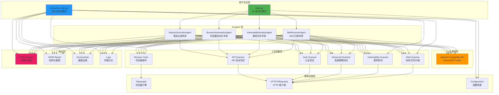
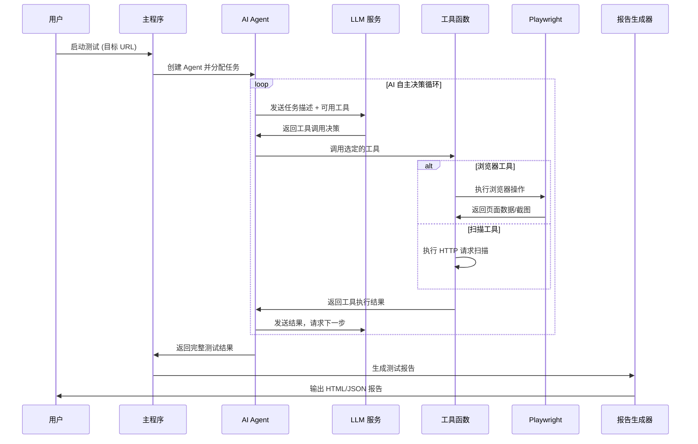

# LSJ WebSec Automation

<div align="center">

**基于 Autogen + Playwright 的智能化自动化渗透测试工具**

[](LICENSE)
[](https://www.python.org/)
[](https://github.com/microsoft/autogen)
[](https://playwright.dev/)

</div>

---

## 📖 项目简介

LSJ WebSec Automation 自动化渗透测试工具，结合了 **Microsoft Autogen** 的 AI Agent 编排能力和 **Playwright** 的浏览器自动化技术，进行自动化渗透测试。


## 🏗️ 系统架构

### 整体架构图



### 工作流程图



---

## 🚀 快速开始

### 环境要求

- Python 3.10+
- Windows / Linux / macOS
- 稳定的网络连接（用于访问 LLM API）

### 安装步骤

1. **克隆项目**

```bash
git clone https://github.com/yourusername/lsj-websec-automation.git
cd lsj-websec-automation
```

2. **创建虚拟环境**

```bash
python -m venv venv

# Windows
venv\Scripts\activate

# Linux/macOS
source venv/bin/activate
```

3. **安装依赖**

```bash
pip install -r requirements.txt
```

4. **安装 Playwright 浏览器**

```bash
playwright install chromium
```

5. **配置环境变量**

```bash
# 复制配置模板
cp .env.example .env

# 编辑 .env 文件，填入你的 API 配置
```

### 配置说明

编辑 `.env` 文件，配置以下关键参数：

```env
# LLM 配置（必填）
OPENAI_API_KEY=your_api_key_here
OPENAI_API_BASE=https://api.openai.com/v1
OPENAI_MODEL=gpt-4o

# Autogen 兼容性补丁（使用 Gemini 等非标准 API 时设为 true）
ENABLE_AUTOGEN_PATCH=true

# Playwright 配置
HEADLESS=false  # 是否无头模式
BROWSER_TIMEOUT=30000

# 扫描器配置
SCANNER_AUTO_CALIBRATE=true  # 自动过滤误报
SCANNER_RATE_LIMIT=40  # 每秒请求数
```

---

## 💻 使用方法

### 模式一：AI 自动化模式（推荐）

运行 `main.py`，由 AI Agent 自主决策测试流程：

```bash
python main.py
```

**功能菜单：**

1. **Web 扫描** - 目录扫描、敏感文件检测、网站结构分析
2. **漏洞测试** - SQL 注入、XSS、LFI、开放重定向测试
3. **浏览器自动化测试** - 表单测试、JavaScript 安全检测、Cookie 分析
4. **完整测试** - 执行以上所有测试

**特点：**
- ✅ LLM 自主决策工具调用顺序
- ✅ 自动分析测试结果并调整策略
- ✅ 生成详细的 HTML + JSON 报告

### 模式二：普通交互式测试模式

运行 `interactive_test.py`，手动选择测试项目：

```bash
python interactive_test.py
```

**功能菜单：**

1. 敏感文件检测
2. 目录扫描
3. SQL 注入测试
4. XSS 跨站脚本测试
5. 本地文件包含测试
6. 开放重定向测试
7. 浏览器访问测试
8. 全面扫描（所有测试）
9. 生成测试报告


## 🔧 核心功能详解

### 1. AI Agent 智能编排

项目使用 Microsoft Autogen 框架实现了四种专业 Agent：

#### WebScannerAgent（Web 扫描专家）
- 🎯 目录模糊测试（基于 ffuf 策略）
- 📁 敏感文件检测（.git、.env、备份文件等）
- 🔍 参数发现与模糊测试
- 🌐 子域名枚举
- 📊 自动校准过滤误报

#### VulnerabilityAnalystAgent（漏洞分析专家）
- 💉 SQL 注入检测（基于错误、布尔、时间盲注）
- 🔓 XSS 跨站脚本测试（反射型、存储型、DOM 型）
- 📂 本地文件包含（LFI）测试
- 🔀 开放重定向漏洞检测
- 🔐 认证绕过测试
- 🆔 IDOR（不安全的直接对象引用）测试
- 🔑 会话管理安全测试
- ⬆️ 权限提升漏洞检测

#### BrowserAutomationAgent（浏览器自动化专家）
- 🎭 真实浏览器模拟（Chromium/Firefox/WebKit）
- 📝 表单自动填充与提交
- 🖱️ 元素点击与交互
- 📸 自动截图取证
- 🔍 页面结构分析
- 🍪 Cookie 安全检测
- 📜 JavaScript 执行与分析

#### ReportGeneratorAgent（报告生成专家）
- 📄 生成详细的 HTML 可视化报告
- 📊 生成结构化 JSON 数据报告
- 🎨 美观的报告样式（响应式设计）
- 📈 漏洞统计与风险评级
- 💡 修复建议与最佳实践

### 2. 高级扫描功能

#### 目录模糊测试
```python
# 支持递归扫描、自动校准、速率限制
await fuzzing_directory_advanced(
    base_url="https://example.com",
    wordlist=["admin", "api", "backup"],
    extensions=[".php", ".html", ".bak"],
    recursion_depth=2,
    auto_calibrate=True,
    rate_limit=40
)
```

#### API 安全测试
```python
# API 端点发现、认证测试、速率限制测试
await discover_api_endpoints(base_url="https://api.example.com")
await test_api_authentication(api_url, endpoints)
await test_api_rate_limiting(api_url)
await test_graphql_introspection(graphql_url)
```

#### 认证与授权测试
```python
# 认证绕过、IDOR、会话管理、权限提升
await test_authentication_bypass(login_url, protected_url)
await test_idor_vulnerability(base_url, id_parameter, range(1, 100))
await test_session_management(login_url, credentials)
await test_privilege_escalation(base_url, user_token, admin_endpoint)
```

### 3. 浏览器自动化

基于 Playwright 实现的真实浏览器操作：

```python
# 导航到目标网站
await navigate_to_url("https://example.com")

# 查找并填充表单
forms = await find_forms()
await fill_form({"username": "test", "password": "test123"})

# 点击按钮
await click_element("button[type='submit']")

# 截图取证
await take_screenshot("login_page")

# 执行 JavaScript
result = await execute_javascript("return document.cookie")

# 分析页面结构
structure = await analyze_page_structure()
```

---

## 📊 测试报告示例

### HTML 报告特性

- ✅ **响应式设计**：支持桌面和移动设备
- ✅ **可视化图表**：漏洞分布、风险等级统计
- ✅ **详细证据**：包含截图、请求/响应数据
- ✅ **修复建议**：针对每个漏洞提供修复方案
- ✅ **时间线**：完整的测试过程记录

### JSON 报告特性

- ✅ **结构化数据**：易于解析和集成
- ✅ **完整信息**：包含所有测试细节
- ✅ **可扩展性**：支持自定义字段

报告文件位置：`output/reports/`

---

## ⚙️ 高级配置

### LLM 模型配置

支持任何 OpenAI 兼容的 API：

```env
# OpenAI 官方
OPENAI_API_BASE=https://api.openai.com/v1
OPENAI_MODEL=gpt-4o

# Gemini（通过代理）
OPENAI_API_BASE=https://your-gemini-proxy.com/v1
OPENAI_MODEL=gemini-2.5-flash
ENABLE_AUTOGEN_PATCH=true

# 本地模型（Ollama/LM Studio）
OPENAI_API_BASE=http://localhost:11434/v1
OPENAI_MODEL=llama3
```

### 扫描器配置

```env
# 自动校准：过滤重复的误报响应
SCANNER_AUTO_CALIBRATE=true

# 速率限制：每秒最大请求数（避免触发 WAF）
SCANNER_RATE_LIMIT=40

# 递归深度：目录扫描的递归层数
SCANNER_RECURSION_DEPTH=2

# 请求超时时间（秒）
SCANNER_TIMEOUT=10
```

### Playwright 配置

```env
# 无头模式（生产环境建议 true）
HEADLESS=false

# 浏览器超时时间（毫秒）
BROWSER_TIMEOUT=30000

# 慢动作模式（调试用，毫秒）
# 在 config/settings.py 中配置 slow_mo
```

---

## 🛡️ 安全与合规

### ⚠️ 重要声明

**本工具仅供授权的安全测试使用！**

- ✅ **合法使用**：仅在获得明确授权的系统上使用
- ❌ **禁止滥用**：未经授权的渗透测试是违法行为
- 📜 **遵守法律**：使用者需遵守所在地区的法律法规
- 🔒 **数据保护**：妥善保管测试报告，避免敏感信息泄露

### 最佳实践

1. **获取授权**：始终获得书面授权后再进行测试
2. **限制范围**：严格限制在授权的测试范围内
3. **速率控制**：合理设置请求速率，避免影响目标系统
4. **数据备份**：测试前确保目标系统有完整备份
5. **报告保密**：测试报告应加密存储，仅授权人员可访问

---

## 📝 许可证

本项目采用 [Apache License 2.0](LICENSE) 许可证。

---

## 🙏 致谢

本项目基于以下优秀的开源项目：

- [Microsoft Autogen](https://github.com/microsoft/autogen) - AI Agent 框架
- [Playwright](https://playwright.dev/) - 浏览器自动化
- [HTTPX](https://www.python-httpx.org/) - 现代 HTTP 客户端
- [Rich](https://github.com/Textualize/rich) - 终端美化
- [Loguru](https://github.com/Delgan/loguru) - 日志管理

---

## 📧 联系方式

- **项目主页**：[GitHub Repository](https://github.com/yourusername/lsj-websec-automation)
- **问题反馈**：[Issues](https://github.com/yourusername/lsj-websec-automation/issues)
- **讨论交流**：[Discussions](https://github.com/yourusername/lsj-websec-automation/discussions)
