# LSJ WebSec Automation
<div align="center">

**基于 Autogen + Playwright 的智能化自动化渗透测试工具**

[](https://github.com/RusianHu/lsj-websec-automation/stargazers)
[](https://github.com/RusianHu/lsj-websec-automation/network/members)
[](LICENSE)
[](https://www.python.org/)
[](https://github.com/microsoft/autogen)
[](https://playwright.dev/)

</div>

---

## 📖 项目简介

LSJ WebSec Automation 自动化渗透测试工具，结合了 **Microsoft Autogen** 的 AI Agent 编排能力和 **Playwright** 的浏览器自动化技术，进行自动化渗透测试。


## 🏗️ 系统架构

### 工作流程图

```mermaid
sequenceDiagram
    participant User as 用户
    participant Main as 主程序
    participant Agent as AI Agent
    participant LLM as LLM 服务
    participant Tools as 工具函数
    participant Browser as Playwright
    participant Report as 报告生成器
    
    User->>Main: 启动测试 (目标 URL)
    Main->>Agent: 创建 Agent 并分配任务
    
    loop AI 自主决策循环
        Agent->>LLM: 发送任务描述 + 可用工具
        LLM->>Agent: 返回工具调用决策
        Agent->>Tools: 调用选定的工具
        
        alt 浏览器工具
            Tools->>Browser: 执行浏览器操作
            Browser->>Tools: 返回页面数据/截图
        else 扫描工具
            Tools->>Tools: 执行 HTTP 请求扫描
        end
        
        Tools->>Agent: 返回工具执行结果
        Agent->>LLM: 发送结果，请求下一步
    end
    
    Agent->>Main: 返回完整测试结果
    Main->>Report: 生成测试报告
    Report->>User: 输出 HTML/JSON 报告
```



---

## 🚀 快速开始

### 环境要求

- Python 3.10+
- Windows / Linux / macOS
- 稳定的网络连接（用于访问 LLM API）

### 安装步骤

1. **克隆项目**

```bash
git clone https://github.com/yourusername/lsj-websec-automation.git
cd lsj-websec-automation
```

2. **创建虚拟环境**

```bash
python -m venv venv

# Windows
venv\Scripts\activate

# Linux/macOS
source venv/bin/activate
```

3. **安装依赖**

```bash
pip install -r requirements.txt
```

4. **安装 Playwright 浏览器**

```bash
playwright install chromium
```

5. **配置环境变量**

```bash
# 复制配置模板
cp .env.example .env

# 编辑 .env 文件，填入你的 API 配置
```

### 配置说明

编辑 `.env` 文件，配置以下关键参数：

```env
# LLM 配置（必填）
OPENAI_API_KEY=your_api_key_here
OPENAI_API_BASE=https://api.openai.com/v1
OPENAI_MODEL=gpt-4o

# Autogen 兼容性补丁（使用 Gemini 等非标准 API 时设为 true）
ENABLE_AUTOGEN_PATCH=true

# Playwright 配置
HEADLESS=false  # 是否无头模式
BROWSER_TIMEOUT=30000

# 扫描器配置
SCANNER_AUTO_CALIBRATE=true  # 自动过滤误报
SCANNER_RATE_LIMIT=40  # 每秒请求数
```

---

## 💻 使用方法

### 模式一：AI 自动化模式（推荐）

运行 `main.py`，由 AI Agent 自主决策测试流程：

```bash
python main.py
```

**功能菜单：**

1. **Web 扫描** - 目录扫描、敏感文件检测、网站结构分析
2. **漏洞测试** - SQL 注入、XSS、LFI、开放重定向测试
3. **浏览器自动化测试** - 表单测试、JavaScript 安全检测、Cookie 分析
4. **完整测试** - 执行以上所有测试

### 模式二：普通交互式测试模式

运行 `interactive_test.py`，手动选择测试项目：

```bash
python interactive_test.py
```

**功能菜单：**

1. 敏感文件检测
2. 目录扫描
3. SQL 注入测试
4. XSS 跨站脚本测试
5. 本地文件包含测试
6. 开放重定向测试
7. 浏览器访问测试
8. 全面扫描（所有测试）
9. 生成测试报告

## 📊 测试报告

报告文件位置：`output/reports/`

---

## ⚙️ 高级配置

### LLM 模型配置

支持任何 OpenAI 兼容的 API：

```env
# OpenAI 官方
OPENAI_API_BASE=https://api.openai.com/v1
OPENAI_MODEL=gpt-4o

# Gemini（通过代理）
OPENAI_API_BASE=https://your-gemini-proxy.com/v1
OPENAI_MODEL=gemini-2.5-flash
ENABLE_AUTOGEN_PATCH=true

# 本地模型（Ollama/LM Studio）
OPENAI_API_BASE=http://localhost:11434/v1
OPENAI_MODEL=llama3
```

### 扫描器配置

```env
# 自动校准：过滤重复的误报响应
SCANNER_AUTO_CALIBRATE=true

# 速率限制：每秒最大请求数（避免触发 WAF）
SCANNER_RATE_LIMIT=40

# 递归深度：目录扫描的递归层数
SCANNER_RECURSION_DEPTH=2

# 请求超时时间（秒）
SCANNER_TIMEOUT=10
```

### Playwright 配置

```env
# 无头模式（生产环境建议 true）
HEADLESS=false

# 浏览器超时时间（毫秒）
BROWSER_TIMEOUT=30000

# 慢动作模式（调试用，毫秒）
# 在 config/settings.py 中配置 slow_mo
```


---

## 🙏 致谢

本项目基于以下优秀的开源项目：

- [Microsoft Autogen](https://github.com/microsoft/autogen) - AI Agent 框架
- [Playwright](https://playwright.dev/) - 浏览器自动化
- [HTTPX](https://www.python-httpx.org/) - 现代 HTTP 客户端
- [Rich](https://github.com/Textualize/rich) - 终端美化
- [Loguru](https://github.com/Delgan/loguru) - 日志管理

---

## 📧 联系方式

- **如果需要更多自动化安全测试工具请联系**：
- yanshanlaosiji@gmail.com

---

## 📝 许可证

本项目采用 [Apache License 2.0](LICENSE) 许可证。
